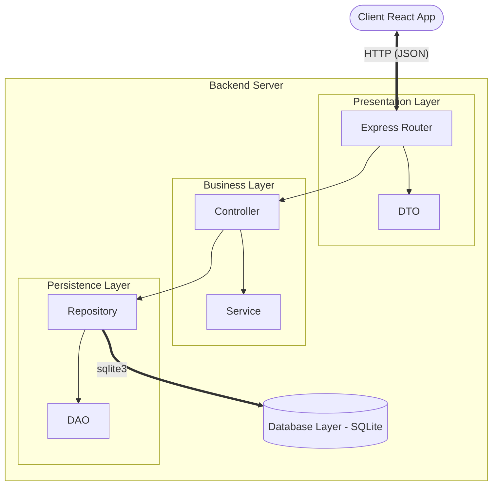
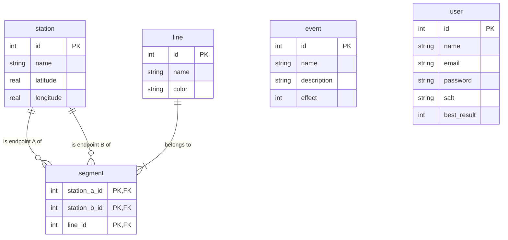

# Exam #1: "Last Race"
> Student: s358479 Ferrero Gabriele 

## Table of Contents
- [1. Server-side](#1-server-side)
  - [API List](#api-list)
  - [Server Architecture](#server-architecture)
  - [Database Tables](#database-tables)
- [2. Client-side](#2-client-side)
  - [React Routes](#react-routes)
  - [Main React Components](#main-react-components)
- [3. Overall](#3-overall)
  - [Data Models](#data-models)
    - [Network](#network)
    - [Station](#station)
    - [Line](#line)
    - [Event](#event)
    - [User](#user)
  - [Screenshots](#screenshots)
  - [Users Credentials](#users-credentials)
  - [Use of AI Tools](#use-of-ai-tools)

---

## 1. Server-side

### API List

The complete list of backend APIs can be explored by visiting [Swagger UI](https://petstore.swagger.io/?url=https://raw.githubusercontent.com/polito-WA1-2026-exam/exam-1-last-race-devgfe/refs/heads/main/doc/swagger.yaml).

### Server Architecture



### Database Tables



- `event`: Defines the unexpected situations that players encounter during their journey, modifying their final coin balance.
- `user`: Manages registered players, handling their authentication state and tracking their highest score for the global ranking.
- `station`: Represents the physical stops within the underground network, including geographic coordinates for map visualization.
- `line`: Represents the distinct metro routes that group and connect the various stations.
- `segment`: Defines the topology of the map, representing valid bidirectional links between adjacent stations on a specific line.

## 2. Client-side

### React Routes

- Route `/`: Welcome page with main menu.
- Route `/login`: User authentication page.
- Route `/game/setup`: Map view.
- Route `/game/planning`: Timed route selection.
- Route `/game/execution`: Live gameplay execution and score calculation.
- Route `/game/result`: Match summary.
- Route `/ranking`: Global leaderboard.
- Route `/instructions`: Game rules.
- Route `*`: Fallback page for non-existing URL paths.

### Main React Components

- `ListOfSomething` (in `List.js`): component purpose and main functionality
- `GreatButton` (in `GreatButton.js`): component purpose and main functionality
- ...

(only _main_ components, minor ones may be skipped)

## 3. Overall

### Data Models

#### Network

```js

```

#### Station

```js

```

#### Line

```js

```

#### Event

```js

```

#### User

```js

```

### Screenshots


### Users Credentials

- **User 1:** email: `mario@test.com`, password: `password` (Played some games)
- **User 2:** email: `luigi@test.com`, password: `password` (Played some games)
- **User 3:** email: `lucia@test.com`, password: `password` (No games played yet)

### Use of AI Tools
Briefly describe whether you used any AI tools (e.g., ChatGPT, GitHub Copilot, Claude) while working on this project, for which purposes (e.g., clarifying concepts, debugging, generating code), and how you verified or adapted their output.
If you did not use any AI tools, simply state so.
