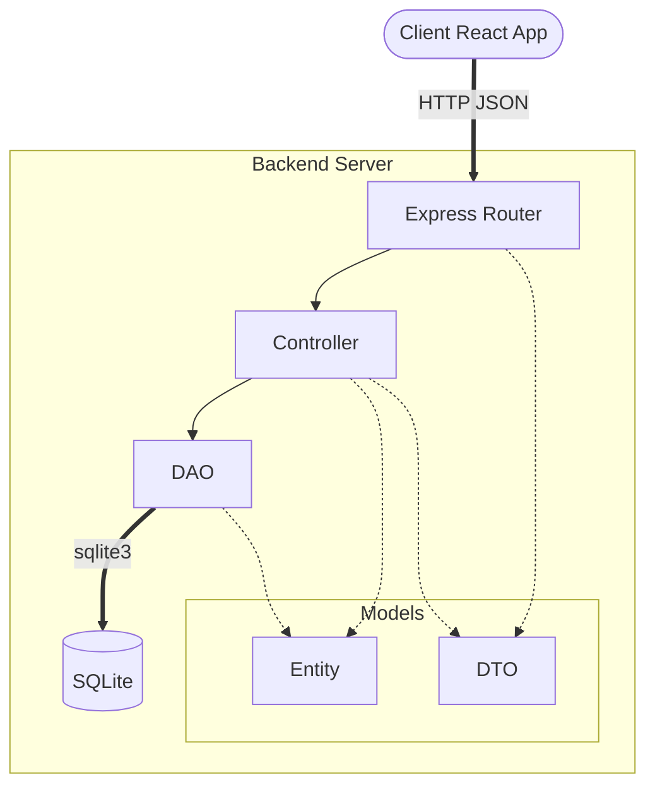
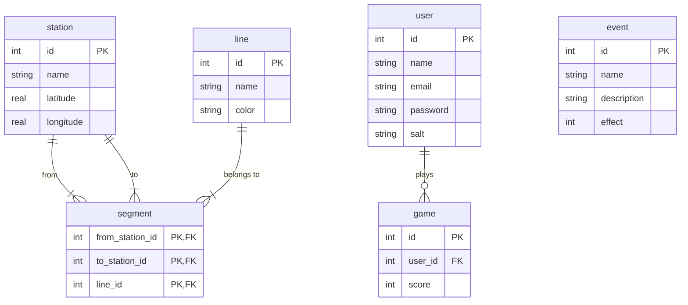
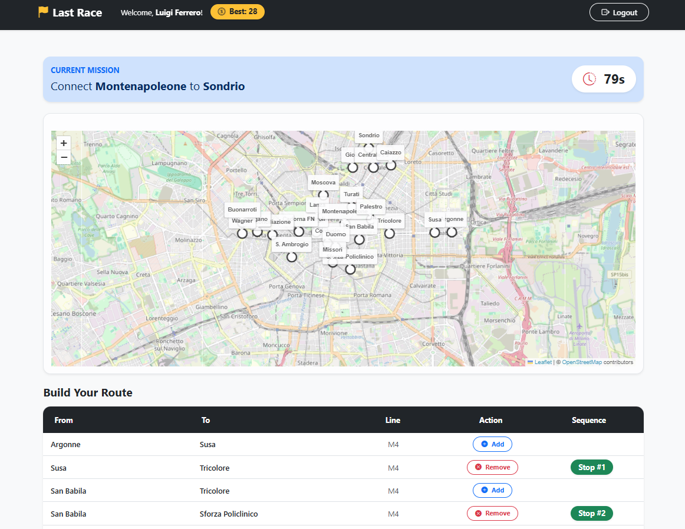
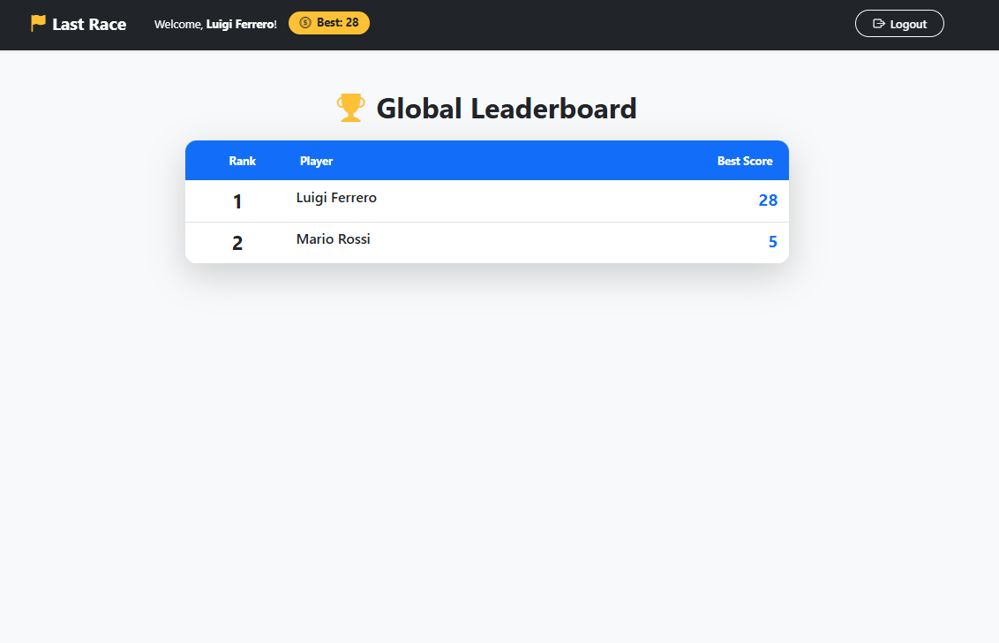

# Exam #1: "Last Race"
> Student: s358479 Ferrero Gabriele 

## Table of Contents
- [1. Server-side](#1-server-side)
  - [API List](#api-list)
  - [Server Architecture](#server-architecture)
  - [Database Tables](#database-tables)
- [2. Client-side](#2-client-side)
  - [React Routes](#react-routes)
  - [Main React Components](#main-react-components)
- [3. Overall](#3-overall)
  - [Screenshots](#screenshots)
  - [Users Credentials](#users-credentials)
  - [Use of AI Tools](#use-of-ai-tools)

---

## 1. Server-side

### API List

The complete list of backend APIs can be explored by visiting [Swagger UI](https://petstore.swagger.io/?url=https://raw.githubusercontent.com/polito-WA1-2026-exam/exam-1-last-race-devgfe/refs/heads/main/doc/swagger.yaml).

### Server Architecture

### Database Tables

- `event`: Defines the unexpected situations that players encounter during their journey, modifying their final coin balance.
- `user`: Manages registered players, handling their authentication state.
- `station`: Represents the physical stops within the underground network, including geographic coordinates for map visualization.
- `line`: Represents the distinct metro routes that group and connect the various stations.
- `segment`: Defines the topology of the map, representing valid unidirectional links between adjacent stations on a specific line.
- `game`: Records each game played by a user.

## 2. Client-side

### React Routes

- Route `/`: Home page with navigation menu; entry point for both anonymous and registered users.
- Route `/login`: Login form for registered users.
- Route `/game/setup`: Setup phase. Displays the full network map with all stations, lines, and connections so the player can study the network before starting.
- Route `/game/planning`: Planning phase. 90-second countdown during which the player selects segments to build a route from the assigned start to the destination.
- Route `/game/execution`: Execution phase. Validates the submitted route, then replays each segment step-by-step applying a random event and updating the coin total.
- Route `/game/result`: Result phase. Shows the final coin score and lets the player start a new game.
- Route `/ranking`: Leaderboard page showing the best score of each registered user.
- Route `/instructions`: Game rules page accessible to all users.
- Route `*`: Fallback page for non-existing URL paths.

### Main React Components

- `MainLayout` (in `MainLayout.jsx`): Top-level shell wrapping every page.
- `HomeLayout` (in `HomeLayout.jsx`): Landing page.
- `LoginLayout` (in `LoginLayout.jsx`): Login form with email and password fields.
- `GameSetupLayout` (in `GameSetupLayout.jsx`): First game phase. Fetches the full metro network (lines, segments, stations) from the API on mount and renders the `MetroMap`.
- `GamePlanningLayout` (in `GamePlanningLayout.jsx`): Planning phase with a 90-second countdown. Displays the `MetroMap` alongside a list of selected segments, the assigned start/destination badges, and add/remove controls for building the route before submitting it.
- `GameExecutionLayout` (in `GameExecutionLayout.jsx`): Execution phase. Submits the planned route to the server and then renders each applied random event.
- `GameResultLayout` (in `GameResultLayout.jsx`): End-of-game screen. Displays the final coin score or an error message, and provides a button to start a new game. 
- `RankingLayout` (in `RankingLayout.jsx`): Global leaderboard page.
- `InstructionLayout` (in `InstructionLayout.jsx`): Game rules page accessible to all users.
- `GameLayout` (in `GameLayout.jsx`): Container layout for the entire game flow.
- `NotFoundLayout` (in `NotFoundLayout.jsx`): Fallback 404 page rendered for any unmatched route.
- `MetroMap` (in `MetroMap.jsx`): Reusable interactive map built with `react-leaflet` and `leaflet-polylineoffset`.

## 3. Overall

### Screenshots

**Game Page** — the planning phase where the player builds their route on the metro map:

**General Ranking Page** — the global leaderboard showing each user's best score:

### Users Credentials

- **User 1:** email: `mario@test.com`, password: `password` (Played some games)
- **User 2:** email: `luigi@test.com`, password: `password` (Played some games)
- **User 3:** email: `lucia@test.com`, password: `password` (No games played yet)

### Use of AI Tools

AI assistance (primarily **Gemini** and **GitHub Copilot**) was used in the following areas:

- **CSS and styling**: AI was consulted for visual design decisions such as layout composition, spacing, component alignment, and general styling tweaks to achieve the desired look.
- **Interactive map implementation**: AI was used to understand how to integrate `react-leaflet` into a React application and how to programmatically draw elements on top of it.
- **Test pipeline setup**: AI helped set up the test infrastructure, including writing the GitHub Actions workflow file (`.github/workflows`) to automatically run the test suite.

In all cases the generated output was reviewed and manually verified for correctness.
