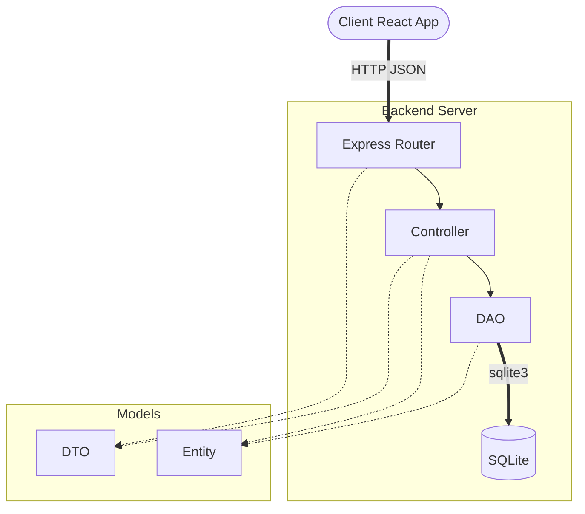
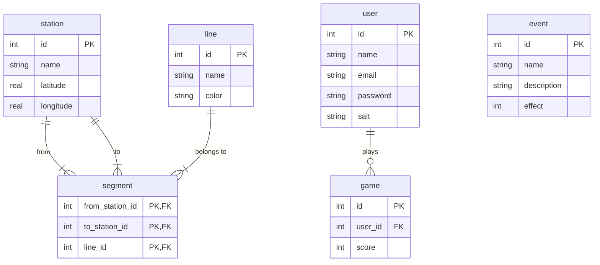

# Exam #1: "Last Race"
> Student: s358479 Ferrero Gabriele 

## Table of Contents
- [1. Server-side](#1-server-side)
  - [API List](#api-list)
  - [Server Architecture](#server-architecture)
  - [Database Tables](#database-tables)
- [2. Client-side](#2-client-side)
  - [React Routes](#react-routes)
  - [Main React Components](#main-react-components)
- [3. Overall](#3-overall)
  - [Screenshots](#screenshots)
  - [Users Credentials](#users-credentials)
  - [Use of AI Tools](#use-of-ai-tools)

---

## 1. Server-side

### API List

The complete list of backend APIs can be explored by visiting [Swagger UI](https://petstore.swagger.io/?url=https://raw.githubusercontent.com/polito-WA1-2026-exam/exam-1-last-race-devgfe/refs/heads/main/doc/swagger.yaml).

### Server Architecture

### Database Tables

- `event`: Defines the unexpected situations that players encounter during their journey, modifying their final coin balance.
- `user`: Manages registered players, handling their authentication state.
- `station`: Represents the physical stops within the underground network, including geographic coordinates for map visualization.
- `line`: Represents the distinct metro routes that group and connect the various stations.
- `segment`: Defines the topology of the map, representing valid unidirectional links between adjacent stations on a specific line.
- `game`: Records each game played by a user.

## 2. Client-side

### React Routes

- Route `/`: Home page with navigation menu; entry point for both anonymous and registered users.
- Route `/login`: Login form for registered users.
- Route `/game/setup`: Setup phase — displays the full network map with all stations, lines, and connections so the player can study the network before starting.
- Route `/game/planning`: Planning phase — 90-second countdown during which the player selects segments to build a route from the assigned start to the destination.
- Route `/game/execution`: Execution phase — validates the submitted route, then replays each segment step-by-step applying a random event and updating the coin total.
- Route `/game/result`: Result phase — shows the final coin score and lets the player start a new game.
- Route `/ranking`: Leaderboard page showing the best score of each registered user.
- Route `/instructions`: Game rules page accessible to all users.
- Route `*`: Fallback page for non-existing URL paths.

### Main React Components

- `ListOfSomething` (in `List.js`): component purpose and main functionality
- `GreatButton` (in `GreatButton.js`): component purpose and main functionality
- ...

(only _main_ components, minor ones may be skipped)

## 3. Overall

### Screenshots

### Users Credentials

- **User 1:** email: `mario@test.com`, password: `password` (Played some games)
- **User 2:** email: `luigi@test.com`, password: `password` (Played some games)
- **User 3:** email: `lucia@test.com`, password: `password` (No games played yet)

### Use of AI Tools
Briefly describe whether you used any AI tools (e.g., ChatGPT, GitHub Copilot, Claude) while working on this project, for which purposes (e.g., clarifying concepts, debugging, generating code), and how you verified or adapted their output.
If you did not use any AI tools, simply state so.
